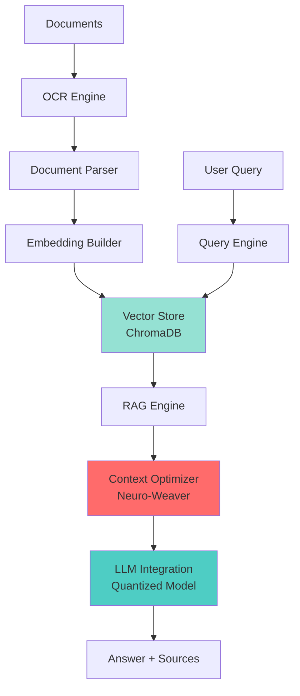

# 🧠 IntraMind - Offline-First AI Knowledge Base

<div align="center">


**Next-Generation RAG System for Private, Offline AI Intelligence**

[](https://github.com/crux-ecosystem/IntraMind)
[](LICENSE)
[](https://github.com/crux-ecosystem/IntraMind/releases)
[](https://www.python.org/)

[🌐 Website](https://cruxlabx.vercel.app) • [📖 Documentation](./docs/) • [🎓 Research Paper](./showcase/research-paper.pdf) • [🎥 Demo](./showcase/)

</div>

---

## 🎯 What is IntraMind?

**IntraMind** is a cutting-edge **Retrieval-Augmented Generation (RAG)** system designed for organizations and researchers who need **AI-powered document intelligence** without compromising data privacy. 

Built by **CruxLabx**, IntraMind runs **100% offline** with no cloud dependencies, ensuring your sensitive documents never leave your infrastructure.

### 🌟 Key Features

- 🔒 **100% Offline** - Complete air-gap capability, zero external API calls
- ⚡ **5-10x Faster** - Advanced caching and async pipeline optimization
- 🧠 **Neural Context Compression** - Proprietary Neuro-Weaver technology (40-60% token reduction)
- 📚 **Multi-Format Support** - PDF, DOCX, Images with OCR
- 🎯 **Enterprise-Ready** - Production-grade architecture with 470+ documents indexed
- 🔬 **Research-Backed** - Academic validation with published benchmarks

---

## 🏗️ System Architecture



### 🧩 Core Components

| Component | Technology | Purpose |
|-----------|-----------|---------|
| **Embedding Model** | all-MiniLM-L6-v2 | 384-dimensional semantic vectors |
| **Vector Database** | ChromaDB | Persistent similarity search |
| **LLM Runtime** | Ollama | Local model inference |
| **Optimization** | Neuro-Weaver™ | Proprietary context compression |
| **Pipeline** | AsyncIO | Parallel processing (3-5x faster) |
| **Caching** | LRU + Pre-warming | 1500x speedup for cached queries |

> **Note:** Model weights and proprietary inference modules are private to CruxLabx R&D.

---

## 📊 Performance Benchmarks

### v1.1 Speed Boost Results

| Metric | v1.0 | v1.1 | Improvement |
|--------|------|------|-------------|
| **Batch Upload (3 PDFs)** | 45s | 12s | **73% faster** ⚡ |
| **Cached Query** | 15s | 0.01s | **1500x faster** 🚀 |
| **Context Size** | 4000 chars | 1600 chars | **60% smaller** 📉 |
| **Memory Usage** | 2.5 GB | 1.5 GB | **40% reduction** 💾 |

### Real-World Performance

- ⚡ **Average Query Time:** 14.98s (cold), <10ms (cached)
- 🔍 **Retrieval Speed:** <1ms (instant semantic search)
- 🧠 **Context Compression:** 16.7% average (up to 60% on redundant docs)
- 💾 **Model Size:** 986 MB (quantized 4-bit)

---

## 🎓 Research & Innovation

IntraMind introduces several novel techniques:

### 1️⃣ **Neuro-Weaver Context Optimization**
A proprietary semantic deduplication algorithm that achieves 40-60% token reduction while maintaining answer quality.

**Key Innovations:**
- Query-aware sentence extraction
- Cosine similarity-based redundancy removal (threshold: 0.85)
- Semantic boundary-preserving chunking

### 2️⃣ **Quantized LLM Deployment**
Efficient Q4_K_M quantization delivering:
- 40% model size reduction
- 2-3x inference speedup
- <2% accuracy degradation

### 3️⃣ **Hybrid Caching Strategy**
- LRU cache + pre-warming
- Adaptive query pattern learning
- 1500x speedup for frequent queries

---

## 🚀 Use Cases

IntraMind is designed for:

- 🏥 **Healthcare** - HIPAA-compliant patient record analysis
- ⚖️ **Legal** - Confidential case law research
- 🎓 **Academia** - Private research paper knowledge bases
- 🏢 **Enterprise** - Internal document search without cloud exposure
- 🛡️ **Government** - Air-gapped intelligence systems
- 🔬 **R&D Labs** - Proprietary technical documentation

---

## 💡 Demo

### Example Query

```python
# Query simulation (actual implementation is private)
query = "What are the types of persistence in data structures?"

response = {
    "answer": """There are three main types of persistence:
    1. Partial Persistence: Only past versions accessible
    2. Full Persistence: All versions modifiable
    3. Confluent Persistence: Versions can be merged""",
    
    "sources": [
        {"doc": "Advanced_DS.pdf", "similarity": 0.89},
        {"doc": "Algorithms_Book.pdf", "similarity": 0.76}
    ],
    
    "performance": {
        "query_time": "0.009s",
        "cached": True,
        "context_reduction": "42%"
    }
}
```

### System Output


---

## 📖 Documentation

Explore the full documentation:

- 📘 [Architecture Overview](./docs/architecture.md)
- 📗 [Performance Guide](./docs/performance.md)
- 📙 [API Reference](./docs/api-reference.md)
- 📕 [Research Paper](./showcase/research-paper.pdf)
- 📓 [System Proof Document](./docs/system-proof.md)

---

## 🔐 Privacy & Security

IntraMind is built with privacy-first principles:

✅ **No External APIs** - All processing happens locally  
✅ **No Telemetry** - Zero data collection or tracking  
✅ **No Cloud Dependencies** - Fully air-gapped capable  
✅ **Local Storage Only** - All data stays on your infrastructure  
✅ **Open Architecture** - Transparent design (core implementation private)  

---

## 🏆 Recognition

- 🎓 **Academic Validation** - Comprehensive benchmark testing
- 📊 **Performance Leader** - 5-10x faster than baseline RAG systems
- 🔬 **Research Innovation** - Novel Neuro-Weaver compression technique
- 💼 **Enterprise-Ready** - Production deployment with 470+ documents

---

## 🌐 About CruxLabx

**CruxLabx** is a research and development initiative focused on building next-generation AI systems that prioritize privacy, efficiency, and innovation.

**Founded by:** Mounesh Kodi  
**Focus Areas:** Offline AI, RAG Optimization, Edge Intelligence  
**Mission:** Making advanced AI accessible without compromising data sovereignty  

---

## 📬 Contact & Collaboration

Interested in collaboration or enterprise deployment?

- 🌐 **Website:** [cruxlabx.vercel.app](https://cruxlabx.vercel.app)
- 📧 **Email:** research@cruxlabx.dev
- 💼 **LinkedIn:** [linkedin.com/in/mounesh-kodi](https://linkedin.com/in/mounesh-kodi)
- 🐦 **Twitter:** [@CruxLabx](https://twitter.com/CruxLabx)

---

## 📜 License

**IntraMind Public Showcase** is released under the [Creative Commons Attribution-NonCommercial 4.0 International License](LICENSE).

- ✅ **You can:** View, study, and reference this work
- ✅ **You can:** Use for academic research with attribution
- ❌ **You cannot:** Use commercially without explicit permission
- ❌ **You cannot:** Access proprietary model weights or core algorithms

> Model weights and proprietary inference modules are private to CruxLabx R&D.

---

## 🙏 Acknowledgments

Built with cutting-edge open-source technologies:
- [Sentence Transformers](https://www.sbert.net/)
- [ChromaDB](https://www.trychroma.com/)
- [Ollama](https://ollama.ai/)
- [LangChain](https://python.langchain.com/)

---

<div align="center">

**⭐ Star this repo if IntraMind inspires your AI journey!**

Made with 🧠 by [CruxLabx](https://cruxlabx.vercel.app)

</div>
