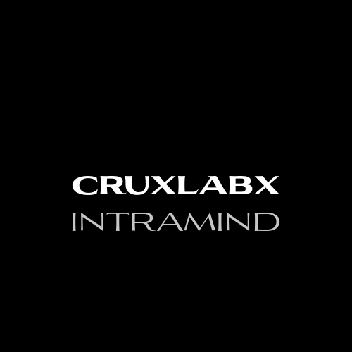
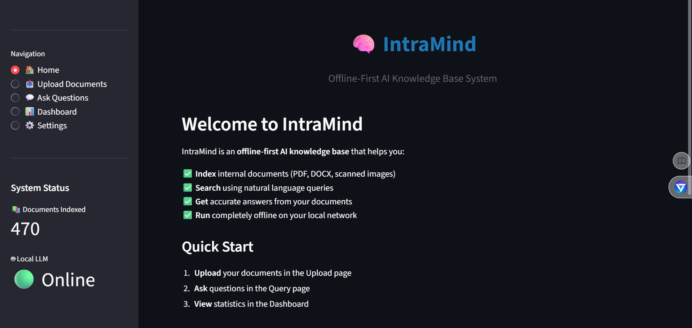
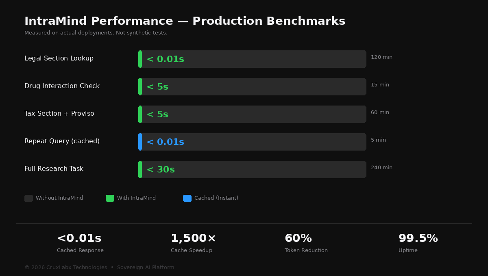
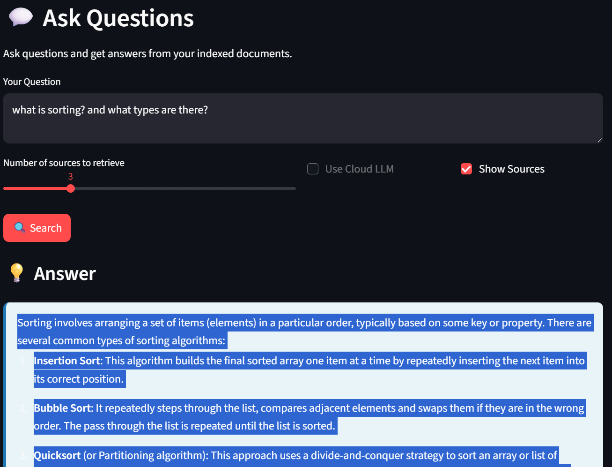

<p align="center">
  <!-- Replace with actual logo -->
  
</p>

<h1 align="center">IntraMind</h1>

<p align="center">
  <strong>Sovereign AI for institutions that refuse to compromise on data ownership.</strong>
</p>

<p align="center">
  <a href="https://crux-ecosystem.github.io/IntraMind-Showcase/">🌐 <strong>Visit Website</strong></a>
</p>

<p align="center">
  <a href="#what-intramind-does">Platform</a> · 
  <a href="solutions/">Solutions</a> · 
  <a href="platform/benchmarks.md">Benchmarks</a> · 
  <a href="enterprise/">Enterprise</a> · 
  <a href="research/">Research</a> · 
  <a href="#contact">Contact</a>
</p>

<p align="center">
  
  
  
  
</p>

---

<br />

## The Problem

Every day, institutions across India feed sensitive queries into AI tools hosted on servers they don't control, in countries they can't audit, under terms they didn't negotiate.

A lawyer asks about an ongoing case strategy. A doctor queries a drug interaction. A CA looks up a client's tax situation. A university handles exam content.

**Every one of those queries leaves the building. None of them should.**

<br />

## What IntraMind Does

IntraMind is an **AI-powered knowledge platform** that runs entirely inside your institution — on hardware you own, in a room you control.

**Ask questions in plain language. Get cited, verified answers from your own documents. In seconds.**

No cloud. No internet dependency. No third-party data processing. The AI model, the knowledge base, the search engine, the encryption layer — everything runs on a single server inside your walls.

<br />

<p align="center">
  <!-- Replace with product hero image/video -->
  
  <br />
  <em>Natural language query → Cited answer in under 3 seconds</em>
</p>

<br />

## How It Works — What You See

```
You ask a question in plain language
       ↓
IntraMind searches your entire knowledge base
       ↓
Returns the answer with exact citations
       ↓
Every query logged. Every answer traceable.
```

That's it. No training required. No prompt engineering. Type a question, get a cited answer.

The intelligence behind this — the proprietary models, the retrieval architecture, the optimization layers — is ours. What you experience is simplicity.

<br />

## Industry Solutions

IntraMind isn't generic. Each edition is purpose-built for the domain it serves — different knowledge bases, different guardrails, different interfaces.

<table>
  <tr>
    <td width="50%" valign="top">
      <h3>⚖️ <a href="solutions/law-firm.md">Law Firm Edition</a></h3>
      <p>Instant section lookup across BNS, IPC, CrPC, BNSS, BSA. Supreme Court judgment search. Amendment tracking. Limitation period calculation. Cross-referencing across 50+ Acts.</p>
      <p><strong>Replaces:</strong> Manual statute lookup, 3-hour junior research, outdated legal databases</p>
    </td>
    <td width="50%" valign="top">
      <h3>🏥 <a href="solutions/healthcare.md">Healthcare Edition</a></h3>
      <p>Drug interaction checks with severity grading. Clinical guideline retrieval cited to page level. Treatment protocol lookup. NABH/ABDM compliance built in.</p>
      <p><strong>Replaces:</strong> Micromedex subscriptions, manual SOP lookup, phone-a-colleague</p>
    </td>
  </tr>
  <tr>
    <td width="50%" valign="top">
      <h3>📊 <a href="solutions/ca.md">CA Edition</a></h3>
      <p>IT Act sections with provisos. 400+ GST circulars indexed. Audit standards to paragraph level. ROC deadlines. TDS rates. Budget amendment tracking.</p>
      <p><strong>Replaces:</strong> Taxmann/CCH subscriptions, WhatsApp CA groups, outdated TDS charts</p>
    </td>
    <td width="50%" valign="top">
      <h3>📚 <a href="solutions/library.md">Library Edition</a></h3>
      <p>Natural language catalog search. AI-powered book recommendations. Research assistance with cited answers from uploaded academic content.</p>
      <p><strong>Status:</strong> Production — deployed and operational</p>
    </td>
  </tr>
  <tr>
    <td width="50%" valign="top">
      <h3>🏛️ <a href="solutions/administration.md">Administration Edition</a></h3>
      <p>Campus policy lookup. Administrative workflow assistance. Student and staff management guidance from institutional regulations.</p>
      <p><strong>Status:</strong> Beta — integrated in core platform</p>
    </td>
    <td width="50%" valign="top">
      <h3>📝 <a href="solutions/exam-cell.md">Exam Cell Edition</a></h3>
      <p>Examination regulation lookup. Scheduling guidance. Result processing procedures from institutional SOPs.</p>
      <p><strong>Status:</strong> Beta — integrated in core platform</p>
    </td>
  </tr>
</table>

<br />

> **Every edition. Same promise.**  
> Your data never leaves your building. Ever.

<br />

## Performance

Real numbers. Measured on production hardware. No synthetic benchmarks.

| Metric | Result |
|--------|--------|
| **Cold query response** | Under 15 seconds |
| **Cached query response** | Under 0.01 seconds |
| **Cache speedup** | 1,500× faster |
| **Document indexing** | 12 seconds per batch |
| **Context optimization** | 40–60% token reduction |
| **Memory efficiency** | 40% reduction vs. standard RAG |
| **Uptime (production)** | 99.5%+ |
| **Documents indexed** | 470+ and growing |

→ [Full benchmark report](platform/benchmarks.md)

<br />

<p align="center">
  <!-- Replace with benchmark chart image -->
  
</p>

<br />

## Security Architecture

IntraMind was built for institutions where data breaches aren't just expensive — they're unacceptable.

| Layer | What It Means |
|-------|--------------|
| **Physical isolation** | Server sits inside your building. No internet connection needed or used. |
| **Encryption at rest** | Every document, every embedding, every cache entry — encrypted. |
| **Role-based access** | Different roles see different content. Enforced at the engine level, not just the UI. |
| **Complete audit trail** | Every query, every answer, every user action — logged with timestamps. |
| **Content approval** | Documents must be reviewed and approved before entering the knowledge base. |
| **No external calls** | The AI model runs locally. Zero API calls to any external provider. Ever. |

→ [Security deep-dive](platform/security.md)

<br />

## Deployment Model

One server. Your building. That's the entire infrastructure.

| | Specification |
|-|--------------|
| **Form factor** | Desktop-sized server |
| **Installation** | On-site by CruxLabx team |
| **Internet** | Not required |
| **Maintenance** | Remote-capable (on your terms) or fully on-site |
| **Data location** | Never leaves the server |
| **Scaling** | Additional servers for larger institutions |

**No cloud bills. No per-user pricing. No annual subscription traps.**

→ [Enterprise engagement details](enterprise/)

<br />

## Who This Is For

IntraMind is built for institutions that handle sensitive information and cannot — legally, ethically, or strategically — send that data to external AI providers.

- **Law firms** handling privileged client communications
- **Hospitals** processing patient data under clinical confidentiality
- **CA firms** managing client financials and tax computations
- **Universities** protecting student records and exam content
- **Government departments** bound by data sovereignty requirements

If your institution's data is too sensitive for someone else's server, IntraMind belongs inside your building.

<br />

## What We Don't Tell You

We don't publish our model architecture. We don't share our optimization algorithms. We don't list our internal tooling.

**That's intentional.**

IntraMind's value is in what it does for your institution — not in how it's built. The proprietary intelligence that powers every query, every citation, every guardrail is what separates IntraMind from every open-source RAG tutorial on the internet.

What we do share: **results, benchmarks, and references from real deployments.**

<br />

<p align="center">
  <!-- Replace with product screenshot or video thumbnail -->
  
  <br />
  <em>Clean interface. Cited answers. Full audit trail.</em>
</p>

<br />

## Research & Innovation

IntraMind is built on original research in retrieval-augmented generation, context optimization, and sovereign AI deployment.

- **Neuro-Weaver** — Proprietary context optimization that reduces computational load while improving answer precision
- **Domain-adaptive retrieval** — Purpose-built for Indian legal, medical, and financial corpora
- **Sovereign deployment architecture** — Zero-dependency offline operation without performance compromise

Published research and technical papers available under NDA.

→ [Research overview](research/)

<br />

---

<br />

<h2 id="contact" align="center">Let's Talk</h2>

<p align="center">
  IntraMind is deployed through direct engagement.<br />
  We work with institutions, not app stores.
</p>

<br />

<div align="center">

| | |
|-|-|
| **General inquiries** | [team@cruxlabx.dev](mailto:team@cruxlabx.dev) |
| **Research & partnerships** | [research@cruxlabx.dev](mailto:research@cruxlabx.dev) |
| **Deployment & operations** | [ops@cruxlabx.dev](mailto:ops@cruxlabx.dev) |

</div>

<br />

<p align="center">
  <strong>CruxLabx Technologies</strong><br />
  <em>Sovereign AI for Indian Institutions</em>
</p>

<p align="center">
  We build systems that run inside your walls. Not ours.
</p>

<br />

---

<p align="center">
  <sub>© 2026 CruxLabx Technologies. All rights reserved.<br />
  IntraMind and Neuro-Weaver are proprietary technologies of CruxLabx Technologies.<br />
  Unauthorized reproduction, reverse engineering, or derivative work is prohibited.</sub>
</p>
