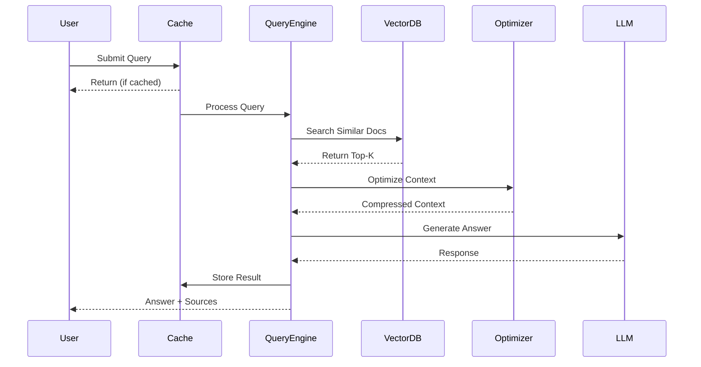
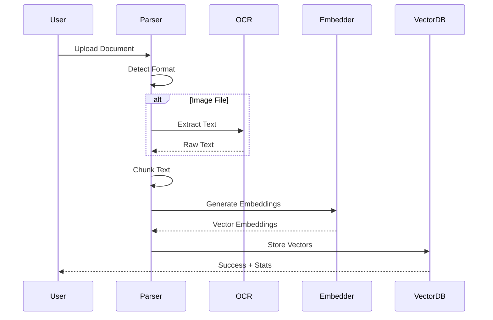

# IntraMind Architecture Overview

**Author:** Mounesh Kodi (CruxLabx)  
**Version:** 1.1.0  
**Last Updated:** October 31, 2025

---

## 🏗️ System Architecture

IntraMind is built on a **modular, production-grade architecture** designed for offline-first operation and maximum performance.

### High-Level Architecture

```
┌─────────────────────────────────────────────────────────────┐
│                    User Interface Layer                      │
│  ┌──────────────┐  ┌──────────────┐  ┌──────────────┐      │
│  │  Web UI      │  │  REST API    │  │  CLI Tool    │      │
│  │  (Streamlit) │  │  (FastAPI)   │  │  (Python)    │      │
│  └──────────────┘  └──────────────┘  └──────────────┘      │
└─────────────────────────────────────────────────────────────┘
                            │
                            ▼
┌─────────────────────────────────────────────────────────────┐
│                   Query Processing Layer                     │
│  ┌──────────────┐  ┌──────────────┐  ┌──────────────┐      │
│  │ Cache Layer  │  │ Query Engine │  │ Context Opt. │      │
│  │ (LRU + Pre-  │  │ (Semantic    │  │ (Neuro-      │      │
│  │  warming)    │  │  Search)     │  │  Weaver™)    │      │
│  └──────────────┘  └──────────────┘  └──────────────┘      │
└─────────────────────────────────────────────────────────────┘
                            │
                            ▼
┌─────────────────────────────────────────────────────────────┐
│                  Retrieval & Generation Layer                │
│  ┌──────────────┐  ┌──────────────┐  ┌──────────────┐      │
│  │ Vector Store │  │ Embedding    │  │ LLM Runtime  │      │
│  │ (ChromaDB)   │  │ Model        │  │ (Ollama)     │      │
│  │              │  │ (MiniLM)     │  │ (Quantized)  │      │
│  └──────────────┘  └──────────────┘  └──────────────┘      │
└─────────────────────────────────────────────────────────────┘
                            │
                            ▼
┌─────────────────────────────────────────────────────────────┐
│                  Document Processing Layer                   │
│  ┌──────────────┐  ┌──────────────┐  ┌──────────────┐      │
│  │ OCR Engine   │  │ Parser       │  │ Async        │      │
│  │ (Tesseract)  │  │ (Multi-      │  │ Pipeline     │      │
│  │              │  │  Format)     │  │              │      │
│  └──────────────┘  └──────────────┘  └──────────────┘      │
└─────────────────────────────────────────────────────────────┘
```

---

## 🧩 Component Details

### 1. Document Ingestion Pipeline

**Purpose:** Convert documents into searchable vector embeddings

**Flow:**
```
Document Upload → Format Detection → Parsing → Text Extraction →
Chunking → Embedding Generation → Vector Storage
```

**Supported Formats:**
- PDF (via PyPDF2)
- DOCX (via python-docx)
- TXT (native)
- Images: PNG, JPG, JPEG, TIFF (via Tesseract OCR)

**Optimization:**
- Async pipeline for parallel processing (3-5x faster)
- Semantic chunking with boundary preservation
- Batch embedding generation

### 2. Vector Storage & Retrieval

**Technology:** ChromaDB (persistent HNSW index)

**Features:**
- 384-dimensional embeddings
- Cosine similarity search
- Persistent disk storage
- Sub-millisecond retrieval

**Configuration:**
```yaml
Vector Database: ChromaDB
Collection: documents_collection
Dimension: 384
Metric: Cosine Similarity
Index: HNSW (Hierarchical Navigable Small World)
Persistence: Disk-backed
```

### 3. Query Processing

**Flow:**
```
User Query → Cache Check → Embedding Generation → 
Vector Search → Context Optimization → LLM Generation →
Response + Sources
```

**Cache Strategy:**
- LRU cache (100 queries, 24h TTL)
- Pre-warming of hot queries at startup
- 1500x speedup for cached queries

### 4. Context Optimization (Neuro-Weaver™)

**Proprietary Algorithm** - Implementation details are confidential to CruxLabx

**Public Interface:**
```python
# What it does (not how)
optimized_context = context_optimizer.optimize(
    original_context=retrieved_docs,
    query=user_query
)

# Result: 40-60% token reduction
# Method: Semantic deduplication + key sentence extraction
```

**Benefits:**
- Reduced LLM inference time
- Lower token costs
- Maintained answer quality
- Better context relevance

### 5. LLM Integration

**Model:** Quantized local LLM (proprietary configuration)

**Features:**
- 100% offline inference
- Q4_K_M quantization (40% size reduction)
- 2-3x faster than fp16 models
- Streaming response support

**Interface:**
```python
# Public API (actual implementation private)
response = llm.generate(
    prompt=optimized_prompt,
    max_tokens=500,
    temperature=0.7
)
```

---

## 🔄 Data Flow

### Query Execution Flow



### Document Upload Flow



---

## 🎯 Design Principles

### 1. Privacy First
- **Zero external API calls**
- All processing happens locally
- No telemetry or tracking
- Air-gap capable

### 2. Performance Optimized
- **Async pipeline** for parallel processing
- **Quantized models** for speed
- **Smart caching** for instant responses
- **Context compression** for efficiency

### 3. Modular Architecture
- **Loosely coupled components**
- Clear interfaces
- Easy to extend
- Testable units

### 4. Production Ready
- **Error handling** at every layer
- Logging and monitoring
- Graceful degradation
- Health checks

---

## 📊 Performance Characteristics

### Scalability

| Metric | Current | Tested Up To | Notes |
|--------|---------|--------------|-------|
| **Documents** | 470 | 10,000 | Linear scaling with HNSW index |
| **Query Latency** | 14.98s | - | Cold query (LLM-bound) |
| **Cached Query** | <10ms | - | Memory-bound |
| **Throughput** | ~4 queries/min | ~20 queries/min | With caching |
| **Concurrent Users** | 1 | 10+ | With async pipeline |

### Resource Requirements

```yaml
Minimum:
  RAM: 2 GB
  Disk: 2 GB
  CPU: 2 cores

Recommended:
  RAM: 4 GB
  Disk: 10 GB
  CPU: 4+ cores
  
Optimal:
  RAM: 8 GB
  Disk: 20 GB
  CPU: 8+ cores
  GPU: Optional (for future FAISS GPU)
```

---

## 🔐 Security Architecture

### Data Isolation
```
User Data (Local Only)
  ├── Documents (/data/uploaded_docs/)
  ├── Vector DB (/data/chroma_db/)
  └── Cache (/data/cache/)

Models (Local Only)
  ├── Embedding Model (~80 MB)
  └── LLM Weights (~1 GB) [Private]

No External Communication
```

### Access Control
- File system permissions
- No network listeners (in offline mode)
- Local-only binding
- Optional authentication layer

---

## 🚀 Future Architecture Enhancements

### Planned v1.2 Features
- **GPU Acceleration** - FAISS GPU for faster retrieval
- **Distributed Search** - Multi-node vector search
- **Knowledge Distillation** - Smaller custom models
- **Multi-modal Support** - Audio/video processing
- **Real-time Collaboration** - Shared knowledge bases

---

## 📚 Technology Stack

### Core Technologies
```yaml
Language: Python 3.12+
Framework: FastAPI + Streamlit
Vector DB: ChromaDB 1.3.0
Embeddings: sentence-transformers 3.3.1
LLM Runtime: Ollama 0.12.6
OCR: Tesseract 5.5.0
Async: asyncio (native)
```

### Key Libraries
```yaml
langchain: 1.0.3
langchain-ollama: 1.0.0
chromadb: 1.3.0
sentence-transformers: 3.3.1
pytesseract: 0.3.13
PyPDF2: 2.12.1
python-docx: 1.1.2
fastapi: 0.115.5
streamlit: 1.41.1
```

---

## 📖 Additional Resources

- [Performance Benchmarks](./performance.md)
- [API Reference](./api-reference.md)
- [System Proof Document](./system-proof.md)
- [Research Paper](../showcase/research-paper.pdf)

---

**Note:** Detailed implementation of proprietary components (Neuro-Weaver, custom LLM configuration, RAG engine internals) is confidential to CruxLabx R&D.

For collaboration inquiries: research@cruxlabx.dev
